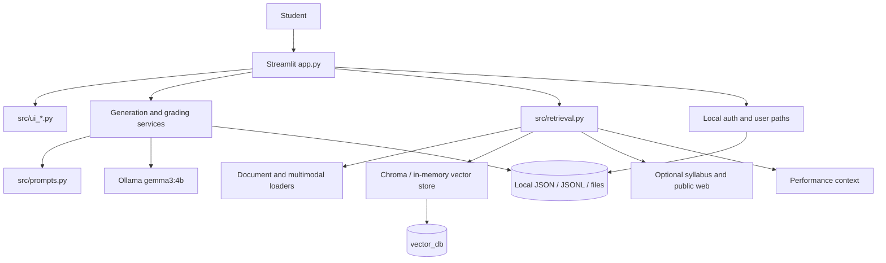

# Codebase Architecture

## 1. Runtime stack

| Layer | Technology | Role |
| --- | --- | --- |
| Application/UI | Streamlit 1.59 | Page composition, session state, uploads, controls |
| Language | Python 3.11 target | Entire application and test suite |
| Local LLM | Ollama, default `gemma3:4b` | Chat, generation, grading, and vision descriptions |
| Retrieval | ChromaDB + sentence-transformers | Persistent vector collections and semantic search |
| Test retrieval | Deterministic hash embeddings + memory store | External-service-free tests and dry runs |
| Documents | pypdf, python-docx, PyMuPDF | Text and multimodal PDF/DOCX ingestion |
| Multimodal | Tesseract, Pillow, faster-whisper | OCR and local transcription |
| Web | requests, DDGS/SearXNG, BeautifulSoup/trafilatura | Optional public-source retrieval and caching |
| Tabular data | pandas | Stats tables |
| Tests | pytest | Unit, integration-style feature, and stability tests |

## 2. Runtime topology

Streamlit reruns the script after UI interactions. Persistent state therefore
lives in files/Chroma, while short-lived UI state lives in
`st.session_state`. Timed attempts are deliberately serialized so reruns do
not reset the timer.

## 3. Layer map

| Layer | Modules | Responsibility |
| --- | --- | --- |
| Composition/UI | `app.py`, `ui_auth`, `ui_navigation`, `ui_practice_modes`, `ui_subject_dashboard`, `ui_docs`, `ui_components` | Authenticate, select subject/page, gather input, render output |
| Domain generation | `quiz_generator`, `mock_exam_generator`, `study_plan_generator`, `grader`, `quiz_mode`, `exam_mode`, `timed_practice` | Prepare prompts, invoke the model, manage attempts and grades |
| Prompt/model | `prompts`, `token_budget`, `llm_client`, `model_runtime`, `ollama_model_manager` | Grounded prompt assembly, size limits, Ollama calls and health |
| Retrieval/ingestion | `retrieval`, `document_loaders`, `multimodal_pdf`, `chunking`, `embeddings`, `vector_store`, `material_router`, `material_manifest` | Discover, parse, chunk, index, and retrieve study material |
| Optional enrichment | `ocr`, `image_understanding`, `audio_transcription`, `syllabus_fetcher`, `web_retrieval`, `source_policy`, `source_citations`, `web_permission` | Multimodal and approved public-source context |
| Identity/storage | `auth`, `user_manager`, `user_data_paths`, `chat_history_store`, `practice_store`, `attempt_session` | Local accounts and durable user artifacts |
| Adaptation/stats | `performance_tracker`, `adaptive_learning`, `stats` | Attempts, mastery, next difficulty, and recommendations |
| Reliability | `config`, `dependency_health`, `app_logging`, `operation_tracker`, `performance_monitor`, `utils` | Settings, diagnostics, graceful failure, common utilities |

## 4. Composition root and navigation

`app.main()` performs startup in this order:

1. Verify Streamlit is importable.
2. Load configuration from defaults plus `Code/.env`.
3. Create shared subject folders and starter goal/criteria files.
4. Configure the Streamlit page.
5. Require local login/registration.
6. Create redacted app-run and anonymized user-session logs.
7. Check/warm the local Ollama runtime.
8. Select a subject and derive its required response language.
9. Dispatch the selected sidebar page to a render function.

The main pages are Home, Subject Dashboard, Subject Chatbot, Quiz Mode, Exam
Mode, Learning Goals, Study Plan, Exam Grader, Notes Ingestion, Feedback, Help,
and Stats/Planner.

## 5. Domain objects

Most cross-module values are frozen dataclasses rather than untyped mappings:

| Type | Module | Meaning |
| --- | --- | --- |
| `AppConfig` | `config` | Fully resolved runtime configuration |
| `Subject` | `subject_registry` | Subject identity, paths, language, and instructions |
| `LoadedDocument` / `TextChunk` / `RetrievedChunk` | loaders/chunking/vector store | Material as it moves through RAG |
| `RetrievalResult` / `StudyContext` | `retrieval` | Retrieved evidence grouped for prompts |
| `LLMResponse` | `llm_client` | Success text or actionable model error |
| `UserRecord` | `auth` | Local account record |
| `PracticeAttempt` | `performance_tracker` | Adaptive performance event |
| `GeneratedPracticeRecord`, `SolutionSetRecord`, `PerformanceReportRecord` | `practice_store` | Durable practice artifacts |
| `TimedAttemptSession` | `attempt_session` | Running/submitted/expired attempt state |

## 6. RAG source priority and prompt budget

Prompt construction preserves the current user request and then packs supporting
context under the configured token budget. The intended priority is:

1. Current user input/instructions.
2. Teacher or user-provided local material.
3. Learning goals and exam criteria.
4. Official syllabus material.
5. Performance memory and generated practice/history.
6. Optional trusted public web material.
7. General instructions.

`token_budget.py` estimates tokens conservatively, trims sections by priority,
reserves model-output capacity, and enforces the hard context ceiling. Defaults
are a 128,000-token model context, 110,000 prompt-input tokens, 8,192 reserved
output tokens, and a 4,096-token safety margin.

## 7. Error and degradation model

The app prefers actionable warnings over global failure:

- no Chroma: selected construction paths use `InMemoryVectorStore`;
- no sentence-transformers: deterministic hash embeddings can be used;
- no Tesseract/PyMuPDF/Whisper/vision model: preserve available text and emit warnings;
- no internet: local material remains usable;
- no Ollama/model: return an `LLMResponse` error and show the prompt/status;
- malformed JSONL lines: readers generally skip invalid/empty rows;
- timed Streamlit rerun: reload serialized attempt state.

This is graceful degradation, not capability equivalence: in-memory indexes are
non-persistent and hash embeddings are intended for tests/fallback behavior.

## 8. Security and privacy boundary

- Passwords use salted PBKDF2 hashes; plaintext passwords are not stored.
- User IDs are sanitized before becoming paths or collection names.
- Diagnostic logging redacts secret-like values and truncates private previews.
- User-scoped vector retrieval applies both a user-specific collection name and
  a `user_id` metadata filter.
- Public web search should use sanitized/public-safe queries and must not send
  private notes unless explicitly allowed by configuration.
- The app is designed for a trusted local machine. JSON files are not encrypted,
  there is no process-level tenant sandbox, and there is no HTTP auth boundary.

## 9. Architectural invariants

- Keep model/provider calls outside UI rendering helpers where a service helper exists.
- Preserve hidden solution files until grading/submission policy permits reveal.
- Always scope user paths through `user_data_paths.py`; do not concatenate raw usernames.
- Keep optional dependencies behind safe wrappers so basic imports and tests work.
- Do not send private query content to public search by default.
- Keep prompts under `AppConfig` token limits.
- Treat `study-swiss-star` API documents as a future contract, not current behavior.
