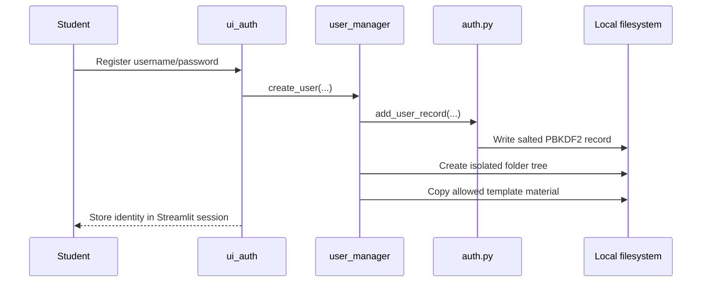
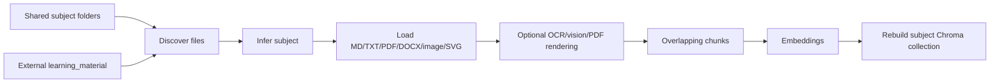
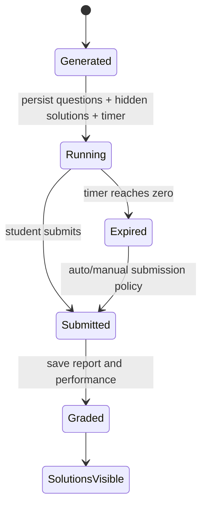

# Data and User Flows

## 1. Storage ownership

| Data | Default location | Scope/format |
| --- | --- | --- |
| Accounts | `data/auth/users.json` | Shared local account DB; JSON |
| Shared subject sources | `data/subjects/<subject>/` | Shared notes/syllabus/criteria/MD files |
| Per-user content | `data/users/<user_id>/` | Isolated directory tree |
| Vector database | `vector_db/` | Persistent Chroma collections |
| Web/syllabus cache | `data/web_cache/` | Cached public source content |
| Practice attempts | `data/performance/attempts.jsonl` by default | Shared config path unless scoped differently |
| Mastery summary | `data/performance/topic_mastery.json` | Configured summary target |
| Feedback | `data/feedback/feedback.jsonl` | Shared append-only JSONL |
| Stats | `data/stats/grades.csv` | Configured CSV target |
| Diagnostics | `bug_review/` | Redacted JSONL logs and test reports |

Generated runtime directories are created on demand. Relative environment paths
are resolved against `Code/`; `~` is expanded.

## 2. Per-user directory layout

```text
data/users/<safe_user_id>/
├── profile.json
├── subjects/<subject_key>/
│   ├── notes/
│   ├── syllabus/
│   ├── criteria/
│   ├── learning_goals.md
│   └── exam_criteria.md
├── chat_history/messages.jsonl
├── chat_media/
│   ├── images/
│   ├── audio/
│   ├── transcripts/
│   └── image_descriptions/
├── generated_practice/
│   ├── quizzes/
│   ├── exams/
│   └── solution_sets/
├── attempts/
├── reports/performance_reports.jsonl
└── rag_exports/
```

Template copying may seed non-personal subject material for a new account. It
must not copy chat history, uploaded media, attempts, reports, grades, or hidden
solutions.

## 3. Login and registration



Authentication is local to the machine. There are no password reset, remote
identity, JWT, role, or permission APIs.

## 4. Material ingestion and indexing



`build_subject_index()` rebuilds rather than incrementally appends the subject
collection. `material_manifest.py` supplies hash/change primitives, but the
primary rebuild path does not currently use the manifest for incremental updates.

## 5. Chat flow

1. Student selects a subject; language is derived automatically.
2. Student supplies text and optional image/audio.
3. Media is stored below the current user's folder.
4. Image OCR/vision and audio transcription run through safe wrappers.
5. `retrieve_study_context()` queries the shared subject vector collection.
6. If enabled and material is missing, syllabus content may be fetched/cached.
7. If explicitly enabled, public web sources may be retrieved.
8. Local performance context is added.
9. `build_multimodal_chat_prompt()` packs all sections under token limits.
10. `generate_response()` calls Ollama.
11. The response, source IDs/layers, and multimodal text are stored in per-user
    chat history; a performance attempt is also appended.

Current caveat: step 5 does not call `retrieve_for_user_subject()`. Therefore
the screen's retrieved study sources are shared subject sources even though its
media and chat records are per-user. The dedicated user-scoped RAG functions
should be used before claiming end-to-end private note retrieval in this page.

## 6. Layered retrieval behavior

`StudyContext` separates:

- `local_context`: vector results from indexed subject material;
- `syllabus_context`: official syllabus fallback chunks;
- `web_context`: optional public-source chunks;
- `performance_context`: mastery/history summary;
- `sources`: structured retrieved chunks for display/citation;
- `warnings`: non-fatal enrichment failures;
- `missing_material_detected`: signal that local material was absent.

Source formatting includes name and optional page, modality, and URL. Public
search is separately controlled by `ALLOW_INTERNET` and the UI checkbox.
`ALLOW_WEB_FOR_PRIVATE_QUERIES=false` is the privacy-oriented default.

## 7. Quiz and exam lifecycle



`timed_practice.start_practice_attempt()` splits model output into visible
questions and a separately stored solution set. The `TimedAttemptSession`
references artifact paths and survives Streamlit reruns. Submission saves
answers, grade/report data, updates status, and makes solutions eligible for
display according to config.

Defaults are 20 minutes for quizzes and 45 minutes for exams. Automatic submit
and hiding solutions until graded are both enabled by default.

## 8. Grading and adaptive learning

Manual grade calculation validates `0 <= achieved <= maximum` and uses the
Swiss point formula. Saved attempts contain subject, topic, feature, difficulty,
question/feedback, points or self-rating, and timestamps.

Adaptive rules aggregate recent point ratios/self-ratings by topic. They select
an easy/medium/hard next difficulty, sort weak topics first, produce prompt
context, and recommend study actions. These are transparent heuristics, not a
trained student model.

## 9. User memory RAG

`rag_memory_indexer.py` converts chat messages, generated practice, reports, and
performance history into documents, exports inspectable JSONL, and indexes a
collection named like `user_<id>__memory_<subject>`. Retrieval uses that unique
collection plus `where={"user_id": ...}` for defense in depth.

This memory pipeline is available to service code and feature tests, but it is
not automatically invoked for every `app.py` chat request.

## 10. External side effects

| Action | Side effect |
| --- | --- |
| Register/login | Read/write local account JSON and user folders |
| Upload material/media | Write local files |
| Build database | Delete/recreate a Chroma collection |
| Ask/generate/grade | HTTP call to local Ollama |
| Fetch syllabus/web | Network requests plus local cache writes |
| Pull model | Potentially large Ollama CLI download |
| Save feedback/attempt | Append local JSONL |
| Diagnostics | Append redacted JSONL/metrics |

## 11. Data migration

`scripts/migrate_single_user_to_user_storage.py` copies legacy single-user data
into the isolated layout without deleting originals. Review source and target
paths before running it. Rebuild user-scoped vector collections after migration;
copied files do not automatically update Chroma.
